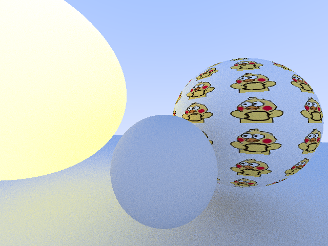

# A Simple Ray Tracer

I made this ray-tracer following this excellent [step-by-step tutorial](https://bheisler.github.io/post/writing-raytracer-in-rust-part-1/)

# about thie branch

I added some extra function to this ray-tracer after finishing the tutorial above.

# test output

